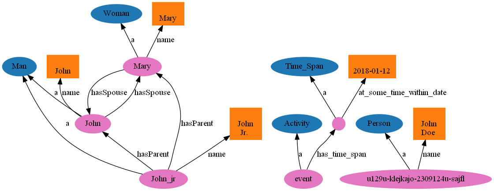

# Showing result of the test.sh

The ontology file: [ontology.ttl](ontology.ttl)  
The Python processing instruction : [ontology_viz.py](ontology_viz.py)  
The bash command that wrapped the whole thing: [test.sh](test.sh)

# Resulting is an image: 

## Test 1 

## Test 2
I removed one of the sample definition.
 

